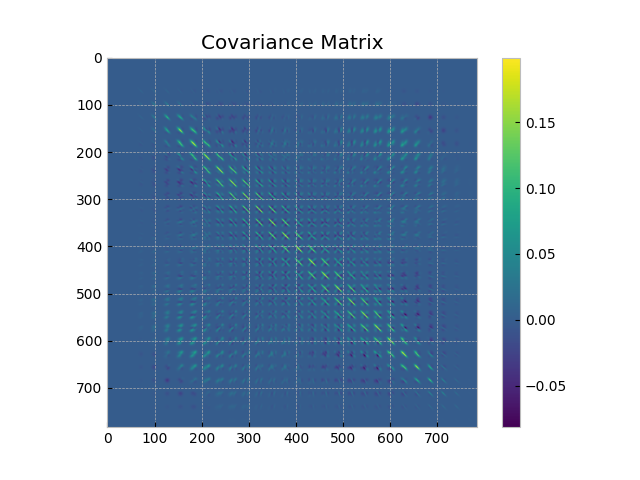
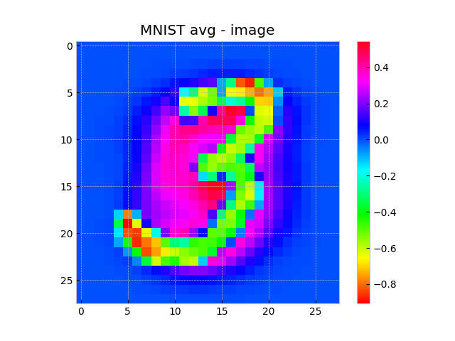

# Eigendigits
Application of feature covariance and eigendecomposition as a statistical model to classify the MNIST digit dataset, inspired by the Eigenfaces method for face recognition proposed by M. Turk and A. Pentland.
|  |  |
|----------|----------|
|  |  |

## Model

Let $\Gamma_n$ be the $n$-th vectorized image:

Mean of the images

$$
\Psi = \frac{1}{M} \sum_{n=1}^M \Gamma_n
$$

Centered vector

$$
\Phi_i = \Gamma_i - \Psi
$$

Centered data matrix $A = [\Phi_1, \Phi_2, \dots, \Phi_M]$:

$$
C = \frac{1}{M} \sum_{n=1}^M \Phi_n \Phi_n^T = A A^T
$$

To avoid high dimensionality

$$
A^T A v_i = \mu_i v_i
$$

Eigendigits

$$
u_i = A v_i
$$

Projection into digit space:

$K$ eigenvectors with the largest eigenvalues

$$
\{\mu_1, \dots , \mu_K\}, \quad \{u_1, \dots, u_K\}
$$

Projecting an image into digit space

$$
\omega_j = u_j^T \Phi, \quad j = 1, \dots, K
$$

To classify digits, the image is projected and its distance to the classes is computed

$$
\epsilon_k^2 = \lVert \omega - \omega_k \rVert^2
$$

Assign the class with the smallest distance under a threshold $\theta_\epsilon$

$$
k^* = \arg\min_k \epsilon_k^2, \quad \text{s.t. } \epsilon_k^2 < \theta_\epsilon
$$

Turk, M. A., & Pentland, A. P. (1991). _Eigenfaces for Recognition_. *Journal of Cognitive Neuroscience*.

# Results
The results were evaluated using top-k accuracy on a test set of 10,000 samples, achieving 66.8% top-1 accuracy, 85% top-3 accuracy, and 96% top-4 accuracy. 